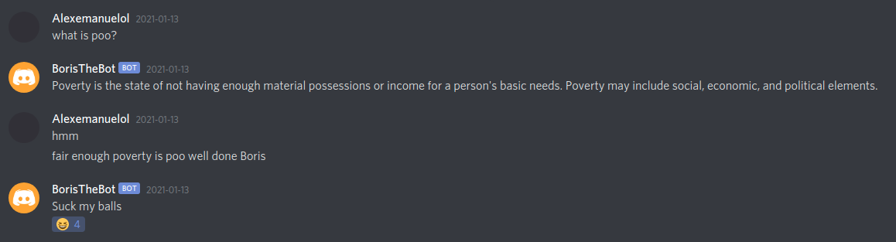

# Discord Bot

A template implementation for a discord bot in python.

## Setup

Follow [this](https://realpython.com/how-to-make-a-discord-bot-python/) guide for how to setup application, bot creating for the discord server and how to access the token.

Run the following to setup the python environment:

    $ pip install -r requirements.txt

